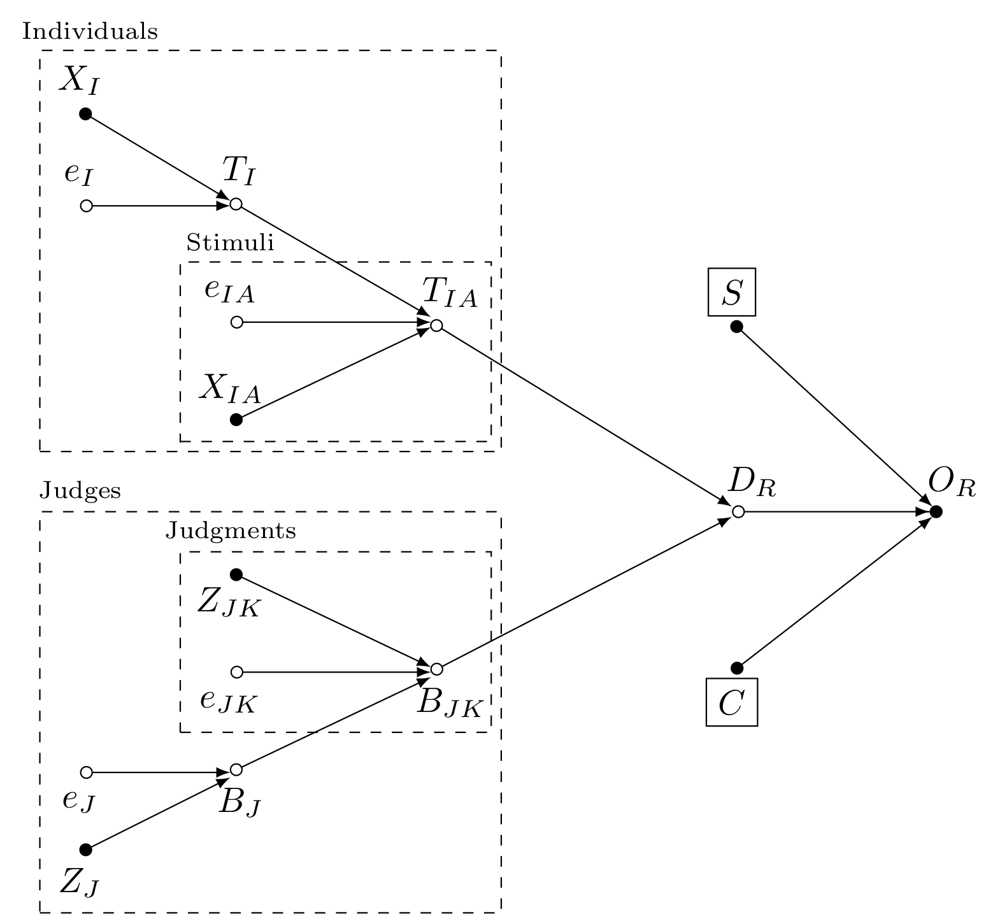

<!-- []{style="color:red;"} -->

<!-- ######################################### -->

# Introduction {#sec-introduction}
<!-- Sven and Tine 2025.08.25, time: 00:04:30 - 00:09:30 -->
<!-- Sven and Tine 2025.08.25, time: 00:10:25 - 00:10:50 -->
<!-- Sven and Tine 2025.08.25, time: 00:23:30 - 00:32:50 -->
<!-- Sven and Tine 2025.09.04, time: 00:28:45 - 00:30:20 -->
<!-- Sven and Tine 2025.09.15, time: 00:02:50 - 00:03:30 -->
<!-- Sven and Tine 2025.09.04, time: 00:00:00 - 00:04:05, perfect -->
<!-- Sven and Tine p2 2026.02.02, time: 00:01:48 - 00:02:49 -->

<!-- 1. What is the CJ? -->
<!-- Sven and Tine 25.08.25, time: 00:04:30 - 00:09:30 -->
<!-- do not make it about speech quality, Put examples of many applications, add a couple more examples. Present it in a more broader way, e.g., "using speech quality as an example" -->
*Comparative judgment* (CJ) has emerged as a valuable methodology for measuring latent traits across diverse fields, including education [@Kimbell_2012; @Jones_et_al_2015; @vanDaal_et_al_2016; @Bartholomew_et_al_2018], political sciences [@Zucco_et_al_2019], linguistics [@Boonen_et_al_2020], and criminology [@Seymour_et_al_2025]. In CJ studies, judges actively compare pairs of stimuli to determine which stimulus exhibits more of the latent trait of interest [@Thurstone_1927a; @Thurstone_1927b].

<!-- 2. How does CJ data is analyzed? -->
A specific data analysis workflow has become the standard approach for analyzing CJ data in education, linguistics, and psychology [see, e.g., @Wu_2025; @Thwaites_et_al_2024; @Maydeu-Olivares_et_al_2005]. In this study, we refer to this workflow as the classical CJ analysis (hereafter, *CCJ analysis*). Researchers favor this approach because it provides a convenient and simple method for measuring traits and conducting subsequent analyses [@Andrich_1978; @Pollitt_2012b]. This simplicity rests on two key features. First, it relies on narrowly specified Thurstone-based models to estimate latent traits. These models facilitate trait estimation by imposing several simplifying assumptions about traits, judges, and stimuli present in the CJ assessments under study [@Thurstone_1927b; @Bramley_2008]. Second, the approach uses ad hoc procedures to conduct follow-up analyses, including data summarization and statistical inference [@Pollitt_2012b].

<!-- 3. But what is the problem with using the BTL model? -->
Recent studies, however, question whether the assumptions of these models--particularly the Bradley-Terry-Luce (BTL) model [@Bradley_et_al_1952; @Luce_1959]--hold in contemporary CJ applications, and whether the ad hoc procedures achieve their intended analytical goals [@Bramley_2008; @Kelly_et_al_2022; @Rivera_et_al_2025]. For instance, @Rivera_et_al_2025 note that while BTL model assumptions of equal dispersions and zero correlations between stimuli simplify trait measurement, they may fail to represent complex traits or heterogeneous stimuli adequately [@Thurstone_1927a; @Andrich_1978; @vanDaal_et_al_2016; @Lesterhuis_et_al_2018; @Chambers_et_al_2022]. Thus, such assumptions can compromise the reliability and accuracy of trait estimates [@Ackerman_1989; @Zimmerman_1994; @McElreath_2020; @Wu_et_al_2022; @Miller_2023; @Hoyle_et_al_2023]. Moreover, although ad hoc procedures simplify data analyses, the use of untested methods can also undermine the validity of inferences derived from CJ data [@McElreath_2020; @Kline_et_al_2023; @Hoyle_et_al_2023].

<!-- 4. How it has been solved? -->
<!-- Sven and Tine p2 2026.02.02, time: 00:07:09 - 00:09:55, summary of Tine  --> 
To address these concerns, @Rivera_et_al_2025 proposed the Information-Theoretical analysis for CJ (hereafter, *ITCJ analysis*), an umbrella analytical workflow designed to accommodate the complexity often observed in applied CJ settings. The approach leverages causal and Bayesian inference methods to combine Thurstone's core theoretical principles with key design features of CJ assessment. This integration enables researchers to develop models tailored to the assumed data-generating process of the CJ system under study, thereby reducing reliance on simplifying assumptions. Moreover, by integrating measurement and inference within a single framework, the ITCJ analysis also eliminates the need for ad hoc analytical procedures. 

<!-- 5. The relevance of the approach -->
The flexibility of the ITCJ analysis is particularly valuable in education, linguistics, and psychology, where CJ data often arises from complex assessment designs [@Bramley_2008; @vanDaal_et_al_2017; @Kelly_et_al_2022]. Its relevance, however, extends well beyond these fields to any discipline implementing CJ assessments, as the approach enables researchers to model the processes they seek to understand rather than those constrained by restrictive statistical models.

<!-- "In assessment, the stimuli presented for judgment are usually fairly long and complex, but short judgment times have often been recorded." [@Kelly_et_al_2022] -->

<!-- "as @Bramley_2008 noted, while it is possible to perceive two shorter stimuli simultaneously, it is not clear that this holds for longer, more complex, stimuli, as judges may need to recall the first stimuli in evaluating the second. He suggested this may lead to order effects in paired comparisons, where features of the first script interfere with the interpretation of the second, and vice versa," [@Kelly_et_al_2022] -->

## Research goals {#sec-introduction_goals}
<!-- Sven and Tine 25.08.25, time: 00:10:25 - 00:10:50 -->
<!-- Sven and Tine 25.08.25, time: 00:23:30 - 00:32:50 -->
<!-- The way to present the document is: this document that aims to validate the model, and by the way this also allow us to guide researchers on how to use the model (a side product). -->
<!-- - Make sure you tell that this paper is a validation study -->
<!-- - Make sure to state what do researchers learn from the document -->
<!-- Sven and Tine 2025.09.04, time: 00:28:45 - 00:30:20 -->
<!-- The model stills need to be empirically tested, the ITCJ implies a complex models which put challenges to integrate it in the workflow -->
<!-- Sven and Tine p2 2026.02.02, time: 00:02:49 - 00:04:35 -->
<!-- It is an "assist" to connect the discussion of the 2nd paper with the research goals of this: "this is a model that it is hard to implement" -->

<!-- 1. Why we want to do it and what are we going to do -->
The ITCJ analysis [@Rivera_et_al_2025] shows theoretical promise for producing reliable trait estimates and accurate statistical inferences. However, as the authors acknowledge, this promise has not yet been empirically validated. This study addresses this gap by pursuing two closely related research goals. The first goal is to *empirically validate* the proposed ITCJ analysis using a simulated speech-quality dataset. This validation assesses the accuracy and reliability of its trait estimates and inference parameters, benchmarked against the CCJ analysis.

The second goal emerges as a practical extension of this validation: *to demonstrate its practical implementation*. To this end, the document adopts a tutorial format, providing step-by-step guidance on data simulation, prior specification, model estimation, and interpretation using `R` [@R_2015], `Stan`[@Stan_2026a; @Stan_2026b], and their interface packages `cmdstanr` [@Gabry_et_al_2025b] and `brms` [@Burkner_2017; @Burkner_2018]. Through this demonstration, the study equips researchers with the tools needed to apply the approach to more complex CJ assessments.

<!-- 2. what is the organization of the manuscript? -->
The remainder of this manuscript is organized into five sections. @sec-theory reviews the primary analytical approach applied to CJ data: the CCJ analysis, and compares it with the ITCJ analysis. @sec-methods describes the assumed data-generating process for the simulated dataset, the simulation procedure, the practical implementation of each analytical approach, and the evaluation criteria aligned with the research goals. @sec-results presents the data description and modeling results. @sec-discussion interprets the findings, outlines future research directions, and considers the study limitations. Finally, @sec-conclusion offers the concluding remarks.

<!-- ######################################### -->

# A tale of two analytical approaches {#sec-theory}
<!-- Sven and Tine 2025.08.25, time: 00:12:20 - 00:14:00 -->
<!-- Sven and Tine 2025.09.04, time: 00:04:05 - 00:04:40 -->
<!-- Sven and Tine 2025.09.15, time: 00:03:30 - 00:04:20 -->

Pairwise comparison data can be analyzed using two main approaches: the CCJ and the ITCJ analysis. The CCJ approach usually relies on a sequence of separate analytical steps to estimate traits and draw inferences. In contrast, the ITCJ analysis uses a single, systematic, and integrated approach to achieve the same objectives. This section provides a detailed description of both approaches.

## The CCJ analysis {#sec-theory_CCJ}
<!-- Sven and Tine 2025.09.04, time: 00:04:40 - 00:07:00 -->
<!-- Sven 2025.09.29, time: 00:00:00 - 00:02:10, issues with residuals -->
<!-- Sven 2026.02.16, time: 00:00:55 - 00:10:20, comment of paper reading -->

<!-- 1. How CCJ analysis is done -->
The CCJ analysis typically proceeds through a sequence of separate analytical steps, each serving a distinct purpose [@Pollitt_2012a; @Pollitt_2012b; @Jones_et_al_2019; @Boonen_et_al_2020; @Chambers_et_al_2022; @Bouwer_et_al_2023]. First, analysts apply narrowly defined Thurstone-based models to CJ data, resulting in two primary outputs: (1) point estimates of stimulus latent scores with their corresponding standard errors, and (2) residuals at the comparison level. These outputs form the basis for any subsequent analyses.

<!-- 2. Other steps in the process -->
<!-- Sven and Tine p2 2026.02.02, time: 00:09:55 - 00:11:05 -->
Second, researchers summarize or fit regression models to the estimated mean latent scores. This step serves multiple purposes, including aggregating stimulus-level point estimates to the individual level, partitioning variability between and within individuals, and drawing inferences about factors that influence trait scores. For example, @Maydeu-Olivares_et_al_2005 fitted multiple factor models to latent means that represent individuals' preferences for compact cars, aiming to provide a more parsimonious representation of these preferences. Similarly, @Boonen_et_al_2020 applied a multilevel regression model to stimulus mean latent scores to examine whether children's age or hearing status affects their intelligibility scores.

A third step may involve summarizing or modeling the residuals. Researchers typically use this step to aggregate the remaining variability at the judge level, partition residual variability between and within judges, test for systematic biases, and identify potential misfitting judgments, stimuli, or judges. For instance, @Wu_2025 fitted an analysis of variance (ANOVA) model to judges' infit statistic to examine whether judge expertise influence judgment behavior. The infit statistics--a weighted average of the squared Pearson residuals--indicates the extent to which judges' decision deviate from expectations relative to other judges [@Wright_et_al_1982]. 

<!-- 3. problems with the stepwise approach -->
One or more of the outlined steps have become standard practice for analyzing CJ data in education, linguistics, and psychology [see, @Wu_2025; @Thwaites_et_al_2024; @Maydeu-Olivares_et_al_2005, respectively]. Nevertheless, despite their widespread adoption, this stepwise approach has an important limitation: it treats outputs from earlier steps as fixed data rather than as uncertain parameter estimates, thereby failing to propagate uncertainty from one stage to the next [@Pritikin_2020]. This lack of uncertainty propagation can introduce bias and decrease the precision of inferences. The direction and magnitude of these biases can be unpredictable: effects may be attenuated, inflated, or remain unaffected depending on the degree of uncertainty in the scores and the true effects under investigation [@McElreath_2020; @Kline_et_al_2023; @Hoyle_et_al_2023]. Moreover, reduced precision lowers statistical power and increases the risk of Type I or Type II errors [@McElreath_2020]. 

<!-- "Factor models can be fit to correlation data. However, in such a two-stage analysis, uncertainty is not accurately propagated from response data to correlation data, and then to factor scores and loadings." [@Pritikin_2020] -->

<!-- 4. What has been done that is not enough -->
<!-- Sven 2026.02.16, time: 00:10:20 - 00:16:10, other paper's integration -->
[Recent developments in CJ modeling have attempted to account for specific features of the CJ data-generating process, thus avoiding reliance on this traditional stepwise approach. However, most studies address only one or two of these features at a time. For instance, ]{style="color:red;"}

<!-- @Maydeu-Olivares_et_al_2005 leverages classical Structural Equation models (SEM) structures to estimate Thurstone's unrestricted, case III, and case IV model, on binary comparative outcomes, but it does not address features such as judges biases (it assumes that judges biases cancel each other), how the sampling of the data and the comparison algorithm impact the results obtained. -->

<!-- @Caron_et_al_2010 It uses conjugancy of priors for the discriminal processes (Yi, Yj ~ exponential(li, lj)) leading to known analytically posteriors ( sum min{Yi, Yj} = Zij ~ gamma, because min{Yi, Yj} ~ exponential(li+lj) ) to presents BTL-like models considering take home advantage, outcomes with ties, and multiple comparison outcomes (as in Placket-Luce model [@Luce_1959; @Placket_1975], Choice models and categorical data. Uses Nascar data to estimate skill of drivers. It uses Chess data with ties to estimate ability of players.  -->

<!-- @Pritikin_2020 measures the psychological state of flow suing an extension of the BTL for ordinal outcome, even considering correlations between the latent scores. Nevertheless, the authors indicate that:
"The models described here are vanilla, bare-bones versions that would benefit from more modeling options."
"In addition, it may be useful to allow structural equation modeling, object covariates, and judge-specific effects (and jusges biases), to investigate measurement invariance"
[@Pritikin_2020, pp. 9]
-->

<!-- @Schramm_et_al_2021 proposes two models. The strong consensus model attempts to measure group-level agreement by constructing a number of continuous latent discriminal process, where their mean and variance depends on the latent "cultural" groups. The weak consensus model, is a hierarchical model with comparison at the lowest level, subjects on the mid level, and latent groups on the top level. -->

<!-- @Mattos_et_al_2022 ppcs R package to run pairwise comparison model using Bayesian inference with Stan. Consider several already known BTL models, that address some but not all features of the data. It including the BTL model for binary, and Davidson model for tied outcomes (mixture model), home advantage and order effects, generalized hierarchical latent model with covariates, including subject specific predictors, but no judges biases -->

<!-- @Seymour_et_al_2022 ran a spatially correlated stimuli model with covariates at the level of the judges to model binary outcomes. But, by design the outcome considers ties (approx. 1/7 or 14% of the data), where these ties are imputed randomly to either win or loose. Moreover, the sampling, and ultimately, the comparison mechanisms depends on individuals covariates, observed and non-observed. Observed covariates, like gender, are considered in the model, but other observed variables, like type of university the individual comes or its occupation, were not considered. They acknowledge this. They do not acknowledge the convenience of the sample affecting the results, and thus, no sensitivity analysis is run to see the extend to which unobserved confounders affect the results. As mentioned, they consider covariates for judges, but there is no consideration of residual variably for these judges. -->

<!-- @Gray_et_al_2024 models the number of wins as outcomes TO DO -->

<!-- @Seymour_et_al_2025 add on @Seymour_et_al_2022 the possibility of modeling outcomes with ties (with spatially correlated stimuli) TO DO -->

## The ITCJ analysis {#sec-theory_ITCJ}
<!-- Sven and Tine 2025.09.04, time: 00:07:00 - 00:09:40 -->
<!-- Sven and Tine p2 2026.02.02, time: 00:00:00 - 00:01:48 -->

<!-- commands for d-separation -->
\newcommand{\dsep}{\:\bot\:}
\newcommand{\ndsep}{\:\not\bot\:}

The ITCJ analysis addresses the aforementioned limitations by providing a unified and systematic approach to analyzing CJ data [@Rivera_et_al_2025]. It starts with a general *Directed Acyclic Graph (DAG)* and a corresponding *Structural Causal Model (SCM)* [@Morgan_et_al_2014; @Gross_et_al_2018; @Neal_2020], which explicitly represent the relationships among observed judgments, discriminal differences, stimulus traits, individual traits, judge biases, and the sampling and comparison mechanisms. This general DAG and SCM establish a coherent theoretical foundation for analysis of CJ data. Next, the approach adapts the general SCM and DAG to the assumed data-generating process of the CJ system under study. Then, it derives one or more bespoke *probabilistic* and *statistical* models tailored to that system. Finally, it uses one or more statistical models to estimate traits and conduct statistical inference. @fig-ITCJ_dag illustrates an example of a general DAG structure.

{#fig-ITCJ_dag fig-align="center" fig-pos="H" width=72%}

In this representation, $O_{R}$ denotes the observed judgment outcome vector, and $D_{R}$ represents the discriminal difference vector. $T_{IA}$ captures the vector of stimulus traits, and $T_{I}$ represents the vector of individual traits. The vector of judgment biases is represented by $B_{JK}$, while the vector of judges' biases by $B_J$. Covariates at the stimulus and individual levels appear as $X_{IA}$ and $X_{I}$, respectively; while $Z_{JK}$ and $Z_{J}$ represent covariates at the judgment and judge levels. The error terms ($e_{IA}$, $e_{I}$, $e_{JK}$, $e_{J}$) capture residual variation at each level.

The DAG also represents the sampling and comparison mechanisms as the vectors $S$ and $C$, two conditioned variables that determine how population outcomes become "observed" (sampled) outcomes. Importantly, the DAG depicts $S$ and $C$ as independent from all other variables by showing no arrows pointing into them. Regarding $S$, this indicates that the DAG applies to *Simple Random Sampling (SRSg)* designs, where each repeated judgment, judge, stimulus, and individual has an equal probability of inclusion within their respective groups [@Lawson_2015]. Regarding $C$, the DAG applies to *Random Allocation Comparative Designs* [@Bramley_2015] or *Incomplete Block Designs* [@Lawson_2015], where every repeated judgment has an equal chance of being included in the sample.

Researchers can then translate this DAG and SCM representations into probabilistic forms that express the joint distribution of a complex CJ system as a product of simpler *conditional probability distributions (CPDs)* [@Pearl_et_al_2016; @Neal_2020; see also @Rivera_et_al_2025, section 5], as illustrated in @fig-ITCJ.

::: {#fig-ITCJ layout-ncol=2 layout-valign="top"}

::: {#fig-ITCJ_scm}
$$
\begin{aligned}
  O_{R} & := f_{O}(D_{R}, S, C) \\ 
  D_{R} & := f_{D}(T_{IA}, B_{JK}) \\
  T_{IA} & := f_{T}(T_{I}, X_{IA}, e_{IA}) \\
  T_{I} & := f_{T}(X_{I}, e_{I}) \\
  B_{JK} & := f_{B}(B_{J}, Z_{JK}, e_{JK}) \\
  B_{J} & := f_{B}(Z_{J}, e_{J}) \\ \\
  e_{I} & \dsep \{ e_{J}, e_{IA}, e_{JK} \} \\
  e_{J} & \dsep \{ e_{IA}, e_{JK} \} \\
  e_{IA} & \dsep e_{JK}
\end{aligned}
$$

SCM
:::

::: {#fig-ITCJ_prob}
$$
\begin{aligned}
  & P( O_{R} \mid D_{R}, S, C ) \\
  & P( D_{R} \mid T_{IA}, B_{JK} ) \\
  & P( T_{IA} \mid T_{I}, X_{IA}, e_{IA} ) \\
  & P( T_{I} \mid X_{I}, e_{I} ) \\
  & P( B_{JK} \mid B_{J}, Z_{JK}, e_{JK} ) \\
  & P( B_{J} \mid Z_{J}, e_{J} ) \\ \\
  & P( e_{I} ) P( e_{IA} ) P( e_{J} ) P( e_{JK} ) \\ \\ \\
\end{aligned}
$$

Probabilistic model
:::

ITCJ analysis. SCM (left) and probabilistic (right) representations for DAG in @fig-ITCJ_dag.
:::

Critically, the approach allows tailoring this general structure to a specific CJ context, enabling development of parsimonious models that match the assumed data-generating process without imposing unnecessary constraints. For example, @Rivera_et_al_2025 modeled a CJ assessment designed to evaluate the impact of different teaching methods on students' writing ability. In this case, the observed outcome was binary, so the model assumed $O_{R}$ followed a Bernoulli distribution. The discriminal difference $(D_{R})$ was determined by the texts' discriminal processes $(T_{IA})$ and the judgment biases $(B_{JK})$. Student-level variables $X_{I}$, such as teaching method, were included, whereas text-level variables $X_{IA}$ (e.g., text length) were not gathered. Similarly, judge-level variables $Z_{J}$, like judgment expertise, were incorporated, while judgment-level variables $Z_{JK}$ (e.g., number of judgments per judge) were absent. Finally, the probabilistic assumptions for the idiosyncratic errors ($e_{I}$, $e_{IA}$, $e_{J}$, $e_{JK}$) were specifically made to resolve indeterminacies in *location*, *orientation*, and *scale* for the variables $T_{I}$, $T_{IA}$, $B_{J}$, $B_{JK}$, as required in latent variable models [@Depaoli_2021; @deAyala_2009]. Other examples include ...

Lastly, researchers derive one or more *bespoke* statistical models tailored to the CJ system of interest, as demonstrated in @Rivera_et_al_2025. At this stage, the ITCJ analysis differs fundamentally from the CBTL approach in how it handles parameter estimation and inference. Rather than fitting multiple separate models, the approach simultaneously estimates all parameters within a single coherent framework using *Bayesian inference*. This joint estimation accounts for uncertainty at all levels and enables direct inference about quantities of interest without relying on post-hoc procedures [@McElreath_2020].

<!-- ######################################### -->

# Methods {#sec-methods}
<!-- Sven and Tine 2025.09.04, time: 00:09:40 - 00:12:25 -->
<!-- Sven and Tine 2025.09.04, time: 00:22:10 - 00:23:05 -->
<!-- Sven and Tine 2025.09.15, time: 00:04:25 - 00:11:45 -->
<!-- Sven and Tine 2025.09.04, time: 00:33:00 - 00:37:15 -->

## Step 1, from Theory to Design: Data-generating assumptions {#sec-methods_step1}
<!-- Sven and Tine 2025.09.04, time: 00:12:25 - 00:22:10 -->
<!-- Sven and Tine 2025.09.04, time: 00:39:00 - 00:48:45 -->
<!-- Sven 2025.09.29, time: 00:02:10 - 00:08:00, estimands -->

## Step 2, from Design to Data: Data simulation {#sec-methods_step2}

<!-- Sven 2025.10.31, time: 00:00:00 - 00:06:15, decision on why one data set -->

<!-- Express the whole simulation procedure with an algorithm snippet -->

## Step 5, from Estimator and Sample to Estimate(s): The analysis aproaches {#sec-methods_step5}
<!-- Sven 2025.09.29, time: 00:13:25 - 00:16:55, software -->

<!-- Tine 2025.10.24, time: 00:02:40 - 00:03:45 -->

### The CCJ analysis {#sec-methods_step5_1}
<!-- Sven and Tine 2025.09.15, time: 00:11:45 - 00:17:55, make it Bayesian -->
<!-- Sven and Tine 2025.09.15, time: 00:20:45 - 00:30:30, make it Bayesian -->
<!-- Sven and Tine 2025.09.15, time: 00:32:30 - 00:32:55 -->
<!-- Sven and Tine 2025.09.04, time: 00:37:15 - 00:38:45, issue with prediction -->
<!-- Sven and Tine 2025.09.13 p1, time: 00:08:55 - 00:17:20, modeling and variability in CBTL analysis -->
<!-- Tine 2025.10.24, time: 00:03:45 - 00:06:00 -->
<!-- Sven 2025.10.31, time: 00:06:15 - 00:09:15, same explanation as with Tine 2025.10.24 -->

### The ITCJ analysis {#sec-methods_step5_2}
<!-- Sven and Tine 2025.09.15, time: 00:17:55 - 00:20:45 -->
<!-- Sven and Tine 2025.09.15, time: 00:30:30 - 00:32:30 -->
<!-- Tine 2025.10.24, time: 00:06:00 - 00:10:40 -->
<!-- Sven 2025.10.31, time: 00:09:15 - 00:11:20, same explanation as with Tine 2025.10.24 -->
<!-- Sven 2025.10.31, time: 00:14:15 - 00:17:25, same explanation as with Tine 2025.10.24 -->

#### Model 1 {#sec-sec-methods_step5_2_itcj_1}

#### Model 2 {#sec-sec-methods_step5_2_itcj_2}

#### Model 3 {#sec-sec-methods_step5_2_itcj_3}

#### Model 4 {#sec-sec-methods_step5_2_itcj_4}

#### Model 5 {#sec-sec-methods_step5_2_itcj_5}

#### Model 6 {#sec-sec-methods_step5_2_itcj_6}

## Step 6, from Estimate(s) to Diagnostics and Posterior predictives: The evaluation criteria {#sec-methods_step6}
<!-- Sven and Tine 2025.09.04, time: 00:23:40 - 00:26:55, with two datas -->
<!-- Sven 2025.09.29, time: 00:16:55 - 00:23:40, still with two datas -->
<!-- Comment2 2025.10.17, posterior confusion matrix, with confidence intervals -->
<!-- Tine 2025.10.24, time: 00:10:40 - 00:11:50 -->
<!-- Sven 2025.10.31, time: 00:17:25 - 00:18:15, same explanation as with Tine 2025.10.24 -->

<!-- ######################################### -->

# Results {#sec-results}

## Data description {#sec-results_data}
<!-- Sven and Tine 2025.09.04, time: 00:58:10 - 01:06:20 -->
<!-- Sven 2025.09.29, time: 00:23:40 - 00:31:40 -->
<!-- Sven and Tine 2025.09.13 p1, time: 00:03:35 - 00:07:50 -->

## Data modeling {#sec-results_modeling}
<!-- Sven and Tine 25.08.25, time: 00:36:45 - 00:44:00 -->
<!-- Mention the dependence on the prior, but consider that the selected priors -->
<!-- are now determined by the CBTL analysis, so it could happen that you will -->
<!-- not need to show the dependence of the priors -->

### The CCJ analysis {#sec-results_modeling_1}
<!-- Sven 2025.09.29, time: 00:31:40 - 00:49:05, do not use all the extra variables from simulation, explanation of the issues with the residuals distribution -->

<!-- Tine 2025.10.24, time: 00:12:35 - 00:14:25 -->
<!-- Extreme cases estimation issue, are they the ones that won or loss all comparisons? -->

<!-- Tine 2025.10.24, time: 00:21:05 - 00:34:05 -->
<!-- continue the analysis without the 'misfit' stimuli -->
<!-- prior distributions for the two additional models -->
<!-- priors for the second models are more conservatives, than what the results of
Boonen reports (1 logit of difference is really high) -->

<!-- Sven 2025.10.31, time: 00:18:15 - 00:19:55, same explanation as with Tine 2025.10.24 -->

<!-- Sven 2025.10.31, time: 00:33:15 - 00:40:00, same explanation as with Tine 2025.10.24  -->

<!-- Sven 2025.09.29, time: 01:32:08 - 01:36:00, how the practice calculates residuals and WMS -->

<!-- Sven and Tine 2025.09.13 p1, time: 00:00:00 - 00:02:55, residual calculations -->

<!-- Sven and Tine 2025.09.13 p1, time: 00:17:20 - 00:19:25, wrong results!! (do not consider) -->

<!-- Sven and Tine 2025.09.13 p1, time: 00:37:55 - 00:39:00, continue modeling -->
<!-- Sven and Tine 2025.09.13 p1, time: 00:39:45 - 00:43:20, wrong results!! (do not consider) -->

<!-- Sven and Tine 2025.09.13 p1, time: 00:43:20 - 00:44:50, judges biases -->

<!-- Tine 2025.10.24, time: 00:34:05 - 00:46:40 -->
<!-- Explaining parameters recovery, RMSEs, confusion matrix, posterior predictive plots for stimuli, individuals, and influential points for judges and stimuli (as extreme stimuli) -->

<!-- Sven 2025.10.31, time: 00:32:20 - 00:33:15, same explanation as Tine 2025.10.24 -->

<!-- Sven 2025.10.31, time: 00:40:00 - 00:45:40, same explanation as Tine 2025.10.24  -->

<!-- Sven 2025.10.31, time: 00:45:40 - 00:46:30, the same influential points in CBTL analysis do not appear on the misfit analysis results (point of discussion) -->

### The ITCJ analysis {#sec-results_modeling_2}
<!-- Sven and Tine 2025.09.15, time: 00:20:45 - 00:26:00 -->
<!-- Sven and Tine 2025.09.13 p1, time: 00:44:50 - 00:54:35 -->
<!-- Sven and Tine 2025.09.13 p2, time: 00:15:25 - 00:21:30, model definitions -->
<!-- Sven and Tine 2025.09.13 p2, time: 00:24:15 - 00:25:00, model definitions -->

<!-- Tine 2025.10.24, time: 00:48:40 - 01:00:05 -->
<!-- Tine 2025.10.24, time: 01:00:45 - 01:15:50 -->
<!-- prior predictive checks and results for all ITCJ analyses: parameter recover, RMSEs, posterior predictive plots, and influential observations -->
<!-- make a point that in Bayesian models you do not need to erase extreme values, the extreme values get shrinkage towards the center just by using the priors -->

<!-- all model are build in the non-centered parametrization -->

<!-- Sven 2025.10.31, time: 00:46:30 - 01:02:40, same explanation as Tine 2025.10.24 -->

<!-- Most important part of the results: 10 percentage points increase in TP and TN compared to the CBTL analysis. -->

#### Model 1 {#sec-results_modeling_2_1}

#### Model 2 {#sec-results_modeling_2_2}

#### Model 3 {#sec-results_modeling_2_3}

#### Model 4 {#sec-results_modeling_2_4}

#### Model 5 {#sec-results_modeling_2_5}

#### Model 6 {#sec-results_modeling_2_6}

#### Model comparison {#sec-results_modeling_2_7}

<!-- Sven 2025.10.31, time: 00:00:00 - 00:00:00 -->

<!-- Tine 2025.10.24, time: 01:15:50 - 01:17:30 -->
<!-- Still considering to use a second data set to validate the model, but you have abandoned this idea already -->

<!-- Tine 2025.10.24, time: 01:22:10 - 01:24:42 -->
<!-- business idea: compare moving dots, that has an objective truths, can help you to detect Eyesights problems, where the main interest of the model is the judges biases, which in this case define the individuals that are getting the test, because the stimuli are the moving dots. -->

<!-- Sven 2025.10.31, time: 01:05:30 - 01:08:10, same explanation as Tine 2025.10.24 -->

<!-- ######################################### -->

# Discussion {#sec-discussion}

<!-- Sven and Tine 2025.09.13 p1, time: 00:07:50 - 00:08:50, summaries do not help -->

<!-- Sven and Tine 2025.09.13 p1, time: 00:08:55 - 00:12:45, modeling and variability in CBTL analysis -->

<!-- Sven and Tine 25.09.04, time: 00:27:45 - 00:00:00 -->
<!-- change the workflow from the practice -->

<!-- Sven and Tine 2025.09.04, time: 00:30:20 - 00:33:30 -->

<!-- Sven 2025.09.29, time: 00:49:05 - 01:20:30, carrying mistakes of estimations, narrow priors, and issues with misfits -->

<!-- Sven 2025.09.29, time: 01:21:55 - 01:30:45, everything perfect with the CBTL analysis, but this is not correct -->

<!-- Sven 2025.09.29, time: 01:20:30 - 01:21:55, ITCJ is better -->

<!-- Sven and Tine 2025.09.13 p1, time: 00:21:00 - 00:37:55, misfit analysis -->
<!-- Sven and Tine 2025.09.13 p1, time: 00:39:00 - 00:39:45, more misfits -->

<!-- Sven and Tine 2025.09.13 p2, time: 00:00:00 - 00:01:15, better to go complex -->

<!-- Comment 2025.10.16 and Comment 2025.10.22 -->
<!-- fit analysis maybe allows you to select model, but also you could observe the posterior distribution of certain parameters to find if the distribution favors simpler models (with informative priors centered at zero, like the horseshoe priors, but how much data do you need?). Important: the process can be done from complex model to simpler, but not the other way around, like from CBTL to complex models -->

<!-- Comment1 2025.10.17, six models are nested models, now you can assess nested hypothesis -->

<!-- Robinson (2021) pp. 3 (59) "A model is only validated with respect to its purpose. It cannot be assumed that a model that is valid for one purpose is also valid for another. For instance, a model of a production facility may have been validated for use in testing alternative production schedules, however, this does not mean that it is necessarily valid for determining that facility’s throughput. " -->

<!-- Sven and Tine 2025.09.13 p2, time: 00:01:15 - 00:04:50, model validation statement -->

<!-- Lawson (2015) p. 7 "An appropriate analysis of data cannot be completed without knowledge of what experimental design was used and how the data was collected, and conclusions are not reliable if they are not justified by the proper modelling and analysis of the data"  -->

<!-- Lawson (2015) p. 177 "In many cases where observational units are different than the experimental units, the observational units will not be independent" -->

<!-- Sven and Tine 2025.09.13 p2, time: 00:04:50 - 00:15:25, prior definition across models and interplay with sample size -->

<!-- Tine 2025.10.24, time: 00:46:40 - 00:48:35 -->
<!-- In CJ practice we cannot discard stimuli, e.g., when the the stimuli represent the work of some students. This recommendation match the statistical recommendation of not eliminating data. In the context of CBTL, the model is stuck with some observations that are extreme and misfit, but they cannot be eliminated. Ideally, this happens because the model is not appropriate, and it should be capturing more of the data-generating process of the data. -->

<!-- Tine 2025.10.24, time: 01:00:05 - 01:00:47 -->
<!-- The problem is not with CBTL analysis, the thing is that if you want to test other hypothesis not contemplated in the data-generating process that CBTL analysis represents, the way to go is NOT building two additional models with the results from the first CBTL analysis, but to modify the model to contemplate the others traits of the data-generating process. -->

<!-- Tine 2025.10.24, time: 01:17:50 - 01:18:30 -->
<!-- The idea of the black swan in modeling validation: you could make several CBTL models for this data, and still you would not fully proof that the CBTL model works, but comparing it with one simulated data set and a different model, proves that the CBTL model does not work under certain scenarios -->

<!-- Sven 2025.10.31, time: 01:02:40 - 01:05:30, 
- 25% of of FP and FN is a lot. 
- Are the models overfitting? -->

<!-- Sven 2025.10.31, time: 01:08:10 - 01:10:15, general discussion -->
<!-- Sven 2025.10.31, time: 01:11:35 - 01:13:40, general discussion -->
<!-- As an applied CJ researcher, if you have any doubts you should consider then the presence of judges biases -->

<!-- recording: Sven 2025.10.31; time: 01:24:21 - 01:31:30 -->
<!-- One point that somebody could bring is that: it could be that judges biases may cancel each other from the model. 
Notably, this assumption entails that the distribution of judges biases is symmetric around the zero axis, that is, two judges biases happen in the same magnitude but in opposite directions of the distribution. Not only that is difficult to happen, but more importantly, the way the CJ experiment takes place ensures that not all judges compare the same stimuli, and not the one stimuli is compared by all the judges. Write down the example that you make in this recording!! -->

<!-- ITCJ analysis leverages causal and Bayesian inference methods to easily combine Thurstone's core theoretical principles with key design features of CJ assessment. Basically, the approach directly maps the assumptions of the data-generating processes, resulting from the theoretical underpinning and the experimental design, to not only a causal model, but also to a probabilistic and ultimately a statistical analysis model. Among these features are not only the types of outcomes available to model, e.g., binary, ordinal, rankings, non-ordered data (as in ties), but also the sampling and comparison algorithms, which have the potential to affect effects and inferences [@cite], but none of the aforementioned literature have considered. Moreover, it consider that when the pairwise comparison experiment involves judges, the possibility of biases is available to be investigated. Not to mention the possibility of fitting models with small sample sizes, In contrast to @Maydeu-Olivares_et_al_2005 which uses Diagonally Weighted Least Squares (DWLS) which relies on asymptotic theory to be valid, and thus, require large sample sizes. Moreover, it is not necessary to use a different method (WLS) to test hypothesis as seen in @Maydeu-Olivares_et_al_2005. In contrast we can use the likelihood for comparing models -->

<!-- Thus, our approach contemplates all of these extensions as special cases. -->

<!-- One thing that is obvious from @Seymour_et_al_2022 is that by implementing each of these models, its seems each author has to develop a new package with a new set of optimization methods.  -->

<!-- We fix delta = 0.01 based on initial runs of the algorithm. @Seymour_et_al_2022 pp. 303 -->

<!-- @Seymour_et_al_2022 took one day to run a model!!, and does not consider covariates at the levels of the wards -->

<!-- a Model does NOT need to have a particular name, it has to reflect as close as possible the  believed data-generating process of the data. -->

<!-- Thurstone’s approach continues to play a fundamental role in the structural investigation of choice data. However, applications of Thurstonian choice models in psychological work are rare because, until recently, model estimation proved to be a complex task and required considerable statistical expertise. Fortunately, this situation has changed. -->
<!-- Maydeu-Olivares et al (2005), pp. 286 -->

<!-- Rasmussen et al (2001)  -->
<!-- "complex processes demand complex models" -->

<!-- "effort to improve model fit might yield insight into overlooked nuances of the data generating process. Given the relative simplicity of the models described here, additional complexity seems more likely to hone interpretation rather than hinder it." [@Pritikin_2020 pp. 9] -->

## Future research directions {#sec-discussion_RD}

<!-- We are trying to do prospective power analysis, however, you should pose the possibility that other authors perform replication power (Kruschke 2013, p. 393). -->
<!-- The next paper is going to perform retrospective power analysis -->

<!-- Sven and Tine 2025.09.13 p1, time: 00:19:25 - 00:21:00, replication studies -->

<!-- Sven and Tine 2025.09.13 p2, time: 00:22:30 - 00:22:45, replication studies -->

<!-- Sven 2025.10.31, time: 01:13:40 - 01:15:55 -->

## Study limitations {#sec-discussion_limitations}

<!-- Robinson (2021) pp. 4-5 (60-61) "Indeed, it is not possible to prove that a model is valid. Instead, it is only possible to think in terms of the confidence that can be placed in a model. The process of verification and validation is not one of trying to demonstrate that the model is correct, but is in fact a process of trying to prove that the model is incorrect. The more tests that are performed in which it cannot be proved that the model is incorrect, the more the clients' (and the modeller’s) confidence in the model grows. The purpose of verification and validation is to increase the confidence in the model and its results to the point where the clients are willing to use it as an aid to decision-making." -->

<!-- Robinson (2021) pp. 6 (62) Alternatively, by expressing the code in a non-technical format a non-expert could check the data and the logic.  -->

<!-- Kruschke (2014) p. 394 "Power analysis is only useful when the simulated data imitate actual data ... We assume that the model is a reasonably good description of the actual data". 
Indeed, that is the reason our model replicates the simulated data, because if in this scenario the model cannot recover the parameters, then no other scenario would make it better at recovering -->

<!-- - model fits the data-generating process, how does the model stand when we want to test hypothesis about a particular data-generating process  -->

<!-- - How strong is the evidence in favor of judges biases. We can solve this from two Bayesian perspectives: from the parameter estimation and the model selection perspective [@Wagenmakers_2014, pp. 178] -->

<!-- Sven and Tine 2025.09.13 p2, time: 00:23:25 - 00:24:00, Bayesian perspective for hypothesis testing -->

<!-- Collett (2023) pp. 425 "The difficulty of specifying prior information in an accurate and non-controversial manner, coupled with a desire to use priors that have little or no influence on the final inference, means that non-informative priors are widely used. However, the use of a flat prior distribution to represent lack of prior knowledge, can be criticized. For example, suppose that a hazard ratio for a treatment effect is a key parameter. A flat prior that is uniform on (0,∞) could be used to express prior ignorance about the value of the hazard ratio. However, this is saying that our prior information is such that a hazard ratio in the range from 0 to 10 is just as plausible as a hazard ratio in the range from 1000 to 1010. This is rather unlikely to be the case. -->
<!-- ... -->
<!-- Although different prior distributions will necessarily lead to different posterior distributions, any such differences may not be of practical importance in terms of inferences to be drawn. ... This is particularly the case for larger datasets, but differences may be more noticeable in smaller ones." -->

<!-- Collett (2023) pp. 426 "There is always some degree of arbitrariness when choosing a prior distribution, and there is often concern about the extent to which a posterior distribution is dependent on the choice that is made. For this reason, a range of plausible priors can be used in an analysis, and the sensitivity of the posterior distribution to these different choices evaluated." -->

<!-- Problem: Shrinked parameter estimates -->
<!-- You need to check: -->
<!-- 1. Priors for the parameters, current are normal(0,0.3). This might be too tight shrinking parameters a lot. Maybe you need to increase it to normal(0,1). (THIS IS THE ONE!) -->
<!-- 2. Remember that the current estimates are not corrected by the sampling probability of the groups (sample size vs population size). Maybe this also impacts the parameter estimates. -->

<!-- Improving sampling parameters: -->
<!-- Sample all parameters (individuals, stimuli, judges and judgments) using: -->

<!-- 1. The assumption that parameters are not correlated:  -->
<!-- - beta ~ multi_normal( rep(0, P), sigma*diag(1,P)*sigma) -->
<!-- - length(sigma) = P (number of parameters) -->

<!-- Pros: this you can do because you directly assume the absence of correlation and a particular sigma among parameters -->
<!-- Cons: how valid is the assumption of no correlation and the sigmas? -->

<!-- Sven 2025.10.31, time: 01:15:55 - 01:19:55 -->
<!-- Why downsize your own evidence? why do you say it is preliminary?, it is preliminary until I do prospective power analysis or the actual mathematical derivation. Because it could happen that by random chance i managed to simulate a data that satisfies the conditions of the model. However, despite this, I am leaving my replicable code in such way that any other researcher can simulate another data set, and check if that new data set also recovers well the parameters and achieves good fit compared to the CBTL analysis, that is, a concept like a crowd sourcing the prospective power analysis. -->
<!-- When you mention the limitation regarding sample size, "to cover this limitation, all the code is available ... " -->

<!-- ######################################### -->

# Conclusion {#sec-conclusion}

<!-- Sven 2025.10.31, time: 01:20:45 - 01:21:25, Conclusions -->

<!-- ######################################### -->



# Declarations {.unnumbered .appendix appendix-style=plain}

**Funding:** The Research Fund (BOF) of the University of Antwerp funded this project.

**Financial interests:** The authors declare no relevant financial interests.

**Non-financial interests:** The authors declare no relevant non-financial interests.

**Ethics approval:** The University of Antwerp Research Ethics Committee confirmed that this study does not require ethical approval.

**Consent to participate:** Not applicable

**Consent for publication:** All authors have read and approved the final version of the manuscript for publication.

**Data, materials and code availability:** A previous version of this manuscript, along with the associated data, materials and code (see the section titled `CODE LINK`), has been made publicly available at: [https://jriveraespejo.github.io/paper3_manuscript/](https://jriveraespejo.github.io/paper3_manuscript/). 

**Licence:** All the code that is original to this study and not attributed to any other authors is copyrighted by [Jose Manuel Rivera Espejo](https://orcid.org/0000-0002-3088-2783) and released under the new [BSD-3-Clause](https://opensource.org/license/BSD-3-Clause) license. 

**AI-assisted technologies in the writing process:** The authors used various AI-based language tools to refine phrasing, optimize wording, and enhance clarity and coherence throughout the manuscript. They take full responsibility for the final content of the publication.

**CRediT authorship contribution statement:** *Conceptualization:* J.M.R.E, T.vD., S.DM., and S.G.; *Methodology:* J.M.R.E, T.vD., and S.DM.; *Software:* J.M.R.E.; *Validation:* J.M.R.E.; *Formal Analysis:* J.M.R.E.; *Investigation:* J.M.R.E; *Resources:* T.vD. and S.DM.; *Data curation:* J.M.R.E.; *Writing - original draft:* J.M.R.E.; *Writing - review and editing:* J.M.R.E., T.vD., S.DM., and S.G.; *Visualization:* J.M.R.E.; *Supervision:* S.G. and S.DM.; *Project administration:* S.G. and S.DM.; *Funding acquisition:* S.G. and S.DM.

<!-- **Acknowledgements:** -->

<!-- ######################################### -->



# Appendix {#sec-appendix .appendix appendix-style=plain}

## Appendix A: Stationarity, converge and mixing {#sec-appendixA .appendix appendix-style=plain}

## Appendix B: Misfit observations {#sec-appendixB .appendix appendix-style=plain}
<!-- Tine 2025.10.24, time: 00:14:25 - 00:21:05 -->
<!-- Misfit stimuli are not necessarily extreme values, but the conceptual understanding of misfit does not match with the operationalization -->
<!-- Data is not simulated with misfits, so what is the tool identifying? -->
<!-- Tine's explanation of what you call a "preference analysis" as in Figure 24 -->

<!-- Sven 2025.10.31, time: 00:19:55 - 00:32:20, The problematic of misfit statistics. Due to the data-generating process, which includes judges biases, lack of transitivity is a common trait of the data. Thus, the question remains: what does the misfit analysis identifies, if lack of transitivity is a common trait of comparative judgment data? -->

<!-- Sven 2025.10.31, time: 00:32:20 - 00:33:15, does the practice of eliminating stimuli is justified? -->

<!-- Sven 2025.10.31, time: 01:10:15 - 01:11:35, misfits and lack of transitivity -->

<!-- Sven 2025.10.31, time: 01:19:55 - 01:00:00, "despite the interesting result regarding misfit analysis, the study did not explicitly design or plan the misfit analysis properly. Thus, more research should be done in this regard." -->

<!-- recording: Sven 2025.10.31; time: 01:22:35 - 01:24:21 -->
<!-- It is not the end of the study. But what I'm trying to do is to change the practice. -->
<!-- Let's assume misfit analysis has its value, how can you be certain that the method is useful, using the wrong model? If you have a slight doubt that your data has judges biases, how can you trust an analysis that does not consider judges biases in the model? -->

## Appendix C: Sample size calculations {#sec-appendixC .appendix appendix-style=plain}
<!-- Sven and Tine 2025.09.04, time: 00:48:45 - 00:58:10 -->
<!-- Sven 2025.09.29, time: 00:08:00 - 00:13:25 -->
<!-- Tine 2025.10.24, time: 00:00:00 - 00:02:40 -->

<!-- ######################################### -->



# References {.unnumbered .appendix appendix-style=plain} 

:::{#refs}

:::
